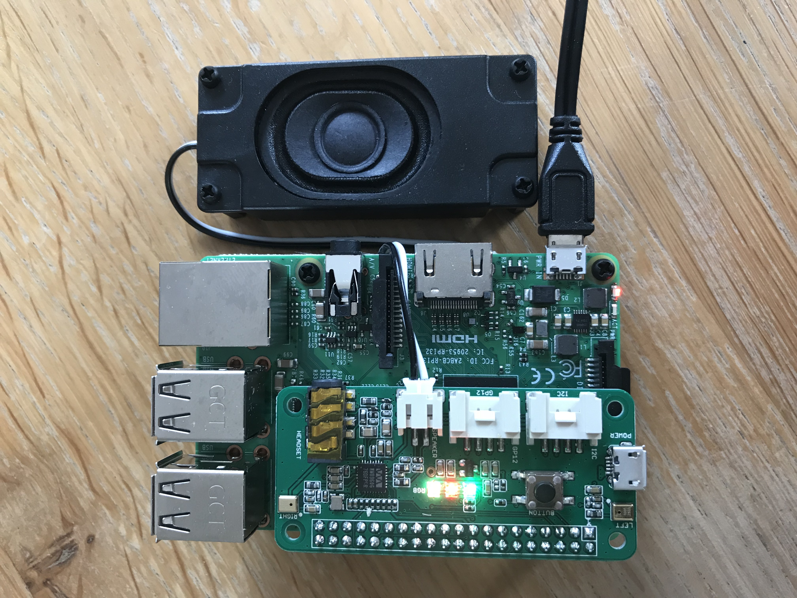

## Hardware used:

- Raspberry 3b+
- reSpeaker 2-mics phat
- a speaker compatible with the phat speaker connector

A good bundle that contains everything your need : https://makers.snips.ai/kit/

My kit

## What we will do ?

We will reach AWS Alexa voice service from a raspberry pi.
To do so we will:

- Create a Alexa product to get all we need to reach Alexa AVS API
- Setup a raspberry with Raspian Stretch lite
- Install the reSpeaker driver and test GPIO for LEDs and action button
- Setup a python environment with all libs we will need
- Install Snowboy for hotword detection (to wake-up your assistant),
- Install a python AVS client
- Install python libraries to link together hotword detection and AVS
- Play with it!

## 0) alexa voice service API access

By following this tutorial https://github.com/alexa/avs-device-sdk/wiki/Create-Security-Profile:

You should be able to collect these information:

- product Id
- client name
- client Id
- client secret
- AmazonId

## 1) Raspian Stretch installation

After having flashed Raspian Stretch lite on a microSD card, from my Mac I go :

    cd /Volumes/boot

	touch ssh

	vi wpa_supplicant.conf

Add this:

	ctrl_interface=DIR=/var/run/wpa_supplicant GROUP=netdev
    network={
      ssid="YOUR_NETWORK_NAME"
      psk="YOUR_PASSWORD"
      key_mgmt=WPA-PSK
    }

## 2) System setup and reSparker driver
    sudo apt-get update -y
    sudo apt-get upgrade -y
    sudo apt-get install -y git vim
    mkdir coach
    cd coach
    git clone https://github.com/respeaker/seeed-voicecard.git
    cd seeed-voicecard
    sudo ./install.sh
    reboot

To test the respeaker (larsen effet!!!) :

    arecord -f cd -Dhw:1 | aplay -Dhw:1

To set volume:

    alsamixer

To save volume settings :

    sudo alsactl store
    sudo alsactl --file=/etc/voicecard/wm8960_asound.state store

## 3) Python Dependencies

    sudo apt-get install -y mpg123 mpv
    sudo apt-get install -y gstreamer1.0-plugins-good gstreamer1.0-plugins-bad gstreamer1.0-plugins-ugly gir1.2-gstreamer-1.0 python-gi python-gst-1.0 libatlas-base-dev libpcre3 libpcre3-dev
    sudo apt-get install -y python-pyaudio  sox python-dev python-virtualenv portaudio19-dev
	  curl -sL https://deb.nodesource.com/setup_8.x | sudo -E bash -
	  sudo apt-get install -y nodejs

Swig 3.0.10 build and install:

    cd coach
    mkdir swig
    cd swig
    wget http://downloads.sourceforge.net/swig/swig-3.0.10.tar.gz
    tar xvzf swig-3.0.10.tar.gz
    cd swig-3.0.10/
    ./configure --prefix=/usr --without-clisp --without-maximum-compile-warnings
    make
    sudo make install
    sudo install -v -m755 -d /usr/share/doc/swig-3.0.10 && sudo cp -v -R Doc/* /usr/share/doc/swig-3.0.10

## 4) Python env setup

    cd coach
    virtualenv --system-site-packages env
    env/bin/python -m pip install --upgrade pip setuptools
    source env/bin/activate

## 5) LEDs and button test

!!! Make sure to use the previously created python virtual env

In coach folder:

To play with the 2Mic PHAT LEDs :

    pip install spidev rpi.gpio

To test LEDs:

    git clone https://github.com/respeaker/mic_hat.git
    cd mic_hat
    python pixels.py

To test PHAT button, with the file button.py (from this repository):

    python button.py

## 6) Snowboy installation & test

!!! Make sure to use the previously created python virtual env

In coach folder, copy the alexa.pmdl file (from this repository), or use any Snowboy model you want (personal or universal)

    git clone https://github.com/Kitt-AI/snowboy.git
    cd snowboy/swig/Python
    make

To test snowboy with a model (i.e. alexa.pmdl), from snowboy folder :

    cd examples/Python/
    python ./demo.py ../../../alexa.pmdl

Then you can say the hotword from your model, snowboy should print out the detection/play a notification sound

To create your own hotword, just go here: https://snowboy.kitt.ai/

## 7) Noise suppression library (webrtc-audio-processing)

!!! Make sure to use the previously created python virtual env

In coach folder :

    git clone https://github.com/xiongyihui/python-webrtc-audio-processing.git
    cd python-webrtc-audio-processing/
    git submodule init && git submodule update
    python setup.py build
    python setup.py install

## 8) AVS python client

!!! Make sure to use the previously created python virtual env

In user home folder create a file .avs.json base on avs.json template. Edit the file to use the information for AWS AVS

Then install avs:

    pip install avs

### 8.1) Alexa authentification

Use alexa-auth to authenticate your device against AVS. The .avs.json should then contains more values retrieved from the OAuth2 authentication process

If you have any issue the authentication process, please make sure you have added url in the "Allowed Return URLs" of the "Web settings" in the configuration of the AWS AVS security profile.

At the moment, Python avs does not support HTTPS for this process, but AWS require it. So just add a HTTPS url, with the ip address of your raspberry as return url in the security profile configuration. When the redirect fail in the browser (https !) just edit the url to replace https with http. And the job is done.

### 8.2) Alexa audio check

Run "alexa-audio-check" to check avs access to audio interface

### 8.3) Run Alexa Voice service from command line

- Run "alexa-tap"
- When you see "INFO:avs.alexa:on_ready" on the console press enter
- Say "what time is it"
- Then you should listen Alexa giving you the current time

## 9) Hand-free demo

!!! Make sure to use the previously created python virtual env

Install voice-engine from reSpeaker:

    pip install voice-engine

Then add manually the compiled snowboy as a local dependencies for voice-engine:

  - from python virtual env folder
  - in lib/python2.7/site-packages/voice_engine
  - create a folder name snowboy
  - into this folder copy the content of the snowboy example for Python (used earlier) :
      cp -rvfL ../../../../../../snowboy/examples/Python/* ./

  (-L is to copy file instead of symbolic links)

Copy the alexa-demo.py file in the "coach" folder and run it. You can adjust the path and name of the snowboy model file.

Then Alexa is waiting for the hotword to listen to you...

The same demo, with noise suppression is available with alexa-demo-with-noisesuppression.py

## 10) All-in-one

!!! Make sure to use the previously created python virtual env

in repository coach folder, you will find an all-one example allowing you to :

- have a hand-free alexa service
- with status notification with LEDs feedback
- to trigger alexa while just pushing the HAT button
